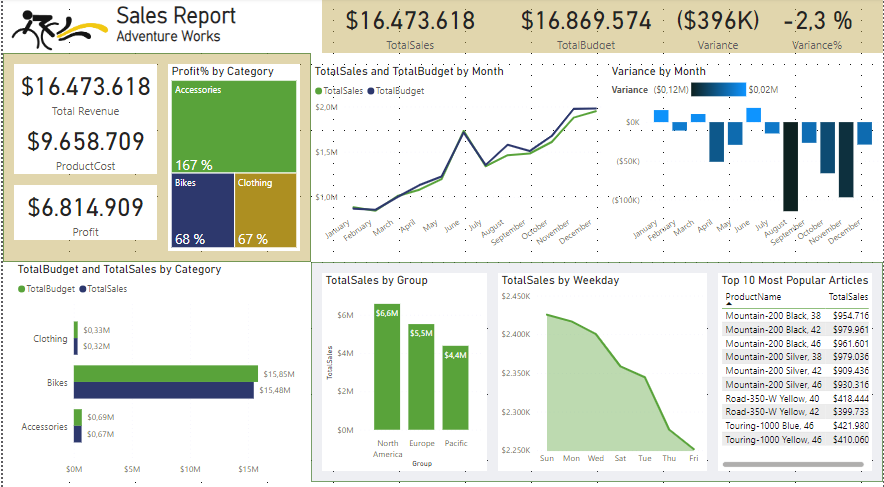
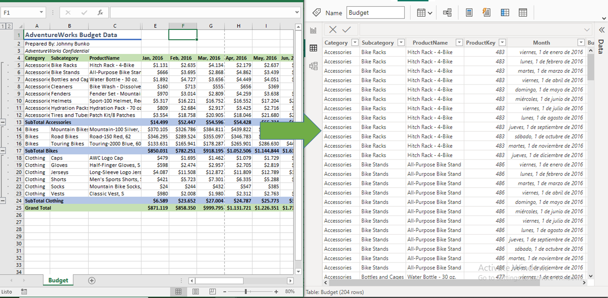
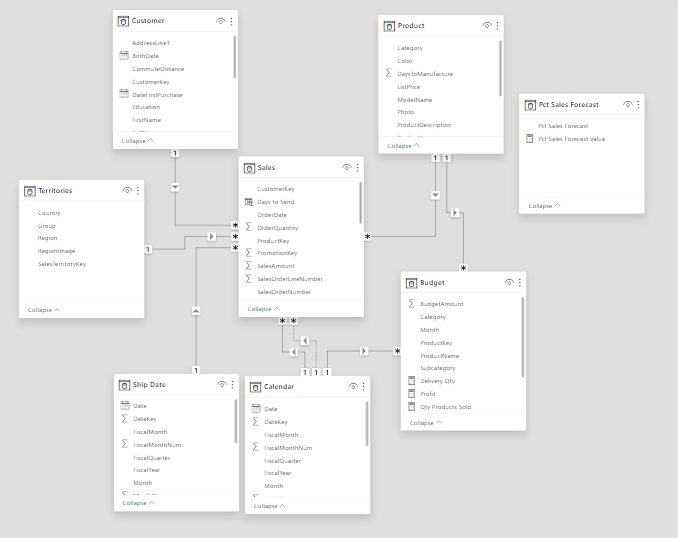
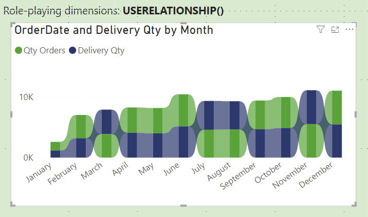
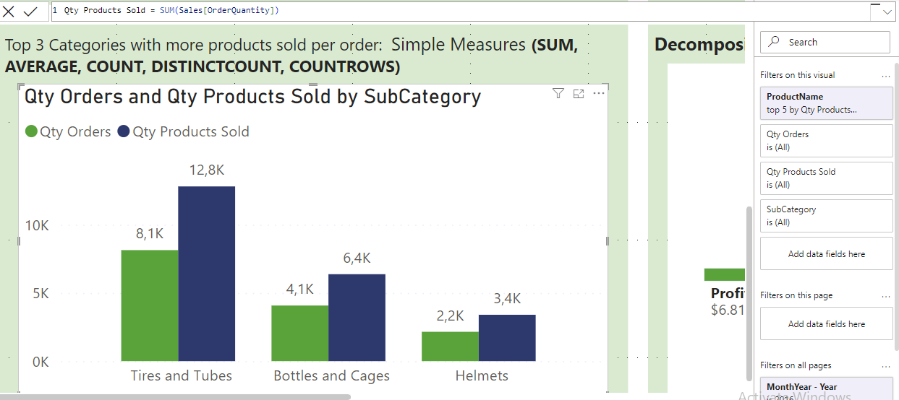
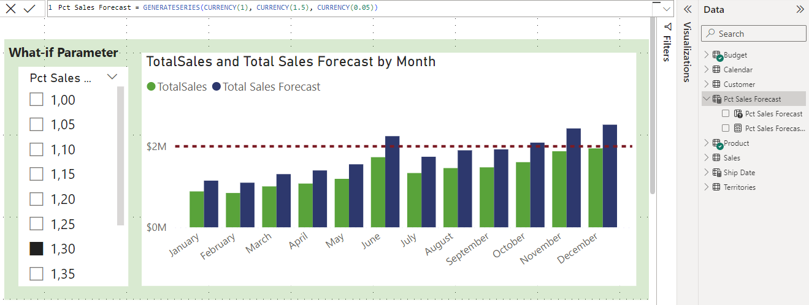

# Adventure Works: Sales Report

## I´m currently study for the exam Power BI Certification

## Prepare data for analysis

Get Data: In Power BI, on the Home tab, select Get data, select Excel. After the file has connected to Power BI Desktop, the Navigator window opens. For Adventure Works only Load the data, for Budget file I transformed the data.

## Clean, transform, and load data

Identify column headers and names
Remove top rows
Promote headers
Apply unpivot columns
Resolve inconsistencies, unexpected or null values, and data quality issues.
Apply user-friendly value replacements.
Profile data so you can learn more about a specific column before using it.
Evaluate and transform column data types.
Apply user-friendly naming conventions to columns and queries.

## Model Data

Star Schema: Determined Fact tables (Sales) and dimension tables (Budget, Product, Customer, Territories)

Model Framework: Import model, because I can integrate source data. Support all DAX and Power Query (M) functionality. Support calculated tables. Deliver the best query performance.
Semantic Model: Create a Data table, create relationships, use relationship function to create a viz using the same calendar table.

Measures, Calculate tables and columns: Simple Measures (SUM, AVERAGE, COUNT, DISTINCTCOUNT, COUNTROWS)

Calculate Tables and What if Parameter

Time Intelligence

## Visualization
Turn data into interactive, actionable insights 
Configure report visuals: Filter, group, summarize.

## Optimize the model

## Security

