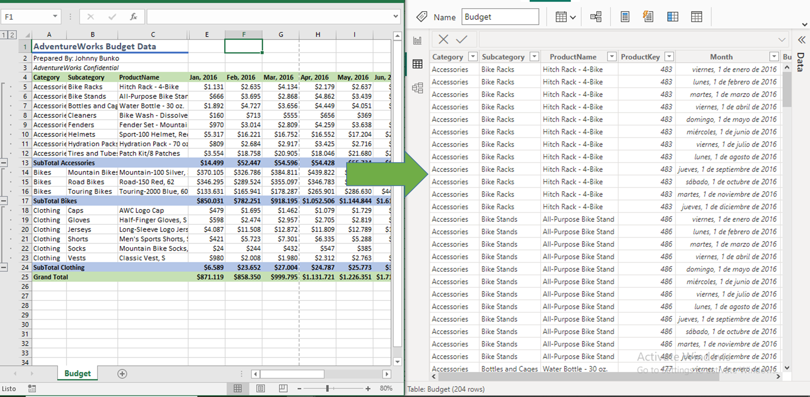
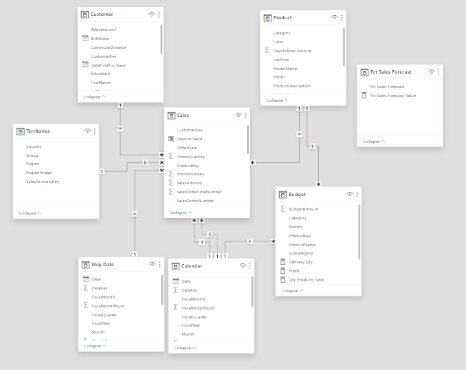
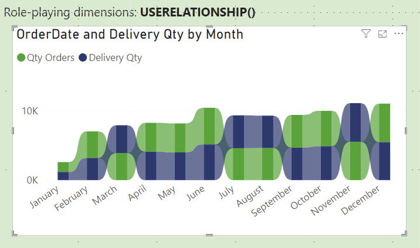
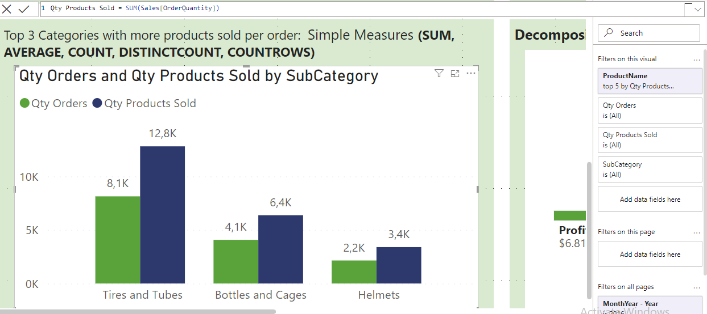
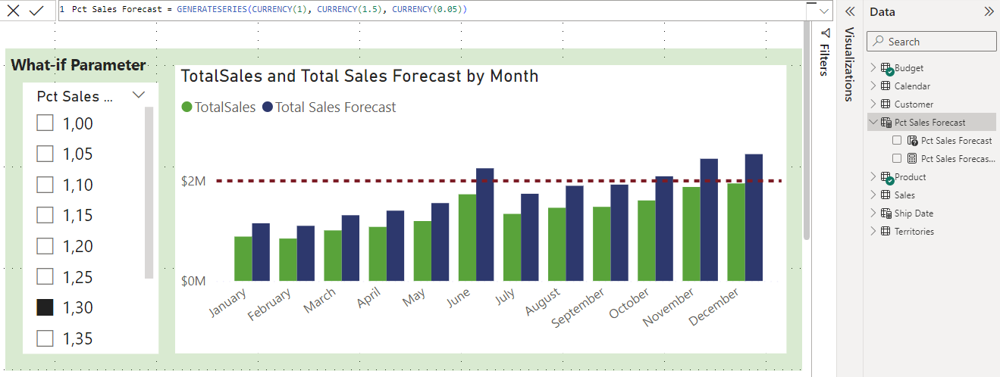
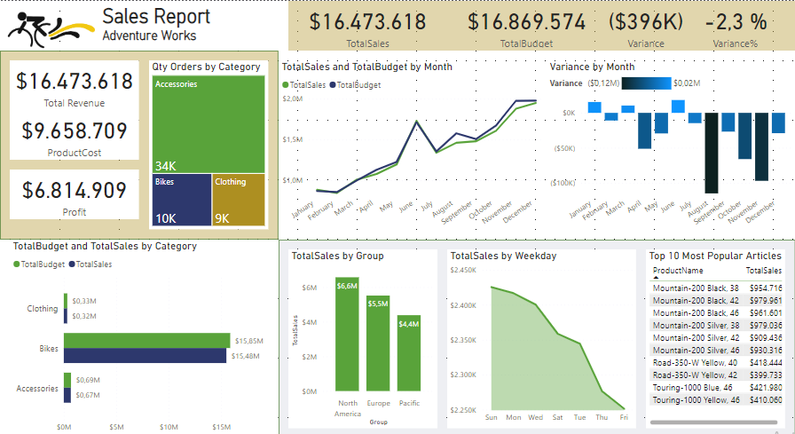
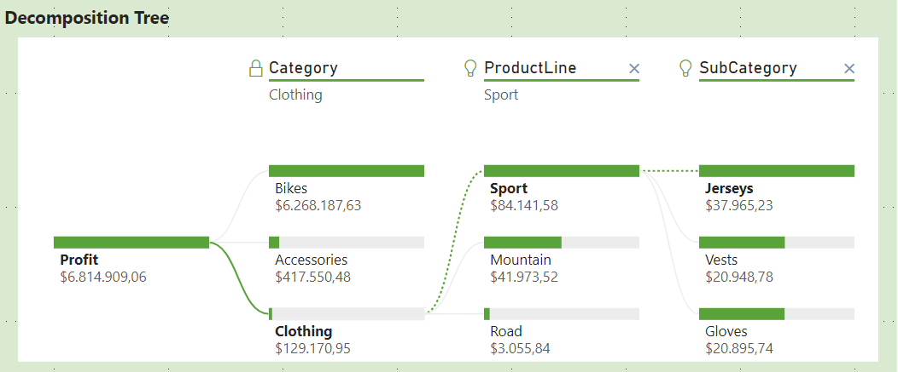

# Adventure Works: Sales Report

I have dedicated myself to continuous skill enhancement through Microsoft's self-paced learning modules, with a specific focus on advancing my proficiency in PowerBI. Leveraging the insightful Adventure Works dataset, I have diligently undertaken a series of exercises and activities to apply and reinforce my PowerBI skills. This project encapsulates the culmination of my efforts, presenting a comprehensive analysis of sales performance during the year 2016, profitability by product category, and a detailed examination of sales point dynamics throughout the week. 

## Prepare data for analysis

Get Data: In Power BI, on the Home tab, select Get data, select Excel. After the file has connected to Power BI Desktop, the Navigator window opens. For Adventure Works only Load the data, for Budget file I transformed the data.

## Clean, transform, and load data

The primary objective is to convert Excel data into a format compatible with Power BI. 



I developed the following task:
- Identify column headers and names.
- Remove top rows and promote headers.
- Apply unpivot columns.
- Resolve inconsistencies, unexpected or null values, and data quality issues.
- Evaluate and transform column data types.
- Apply user-friendly naming conventions to columns and queries.

Code M:

    Source = Excel.Workbook(File.Contents("C:\Users\Usuario\OneDrive\DATA\Data Projects\PowerBI\24.02.16\Budget.xlsx"), null, true),
    Budget_Sheet = Source{[Item="Budget",Kind="Sheet"]}[Data],
    #"Removed Top Rows" = Table.Skip(Budget_Sheet,3),
    #"Promoted Headers" = Table.PromoteHeaders(#"Removed Top Rows", [PromoteAllScalars=true]),
    #"Changed Type" = Table.TransformColumnTypes(#"Promoted Headers",{{"Category", type text}, {"Subcategory", type text}, {"ProductName", type text}, {"ProductKey", Int64.Type}, {"Jan, 2016", Int64.Type}, {"Feb, 2016", Int64.Type}, {"Mar, 2016", Int64.Type}, {"Apr, 2016", Int64.Type}, {"May, 2016", Int64.Type}, {"Jun, 2016", Int64.Type}, {"Jul, 2016", Int64.Type}, {"Aug, 2016", Int64.Type}, {"Sep, 2016", Int64.Type}, {"Oct, 2016", Int64.Type}, {"Nov, 2016", Int64.Type}, {"Dec, 2016", Int64.Type}, {"Grand Total", Int64.Type}}),
    #"Filtered Rows" = Table.SelectRows(#"Changed Type", each not Text.Contains([Category], "Total")),
    #"Removed Columns" = Table.RemoveColumns(#"Filtered Rows",{"Grand Total"}),
    #"Unpivoted Columns" = Table.UnpivotOtherColumns(#"Removed Columns", {"Category", "Subcategory", "ProductName", "ProductKey"}, "Attribute", "Value"),
    #"Changed Type1" = Table.TransformColumnTypes(#"Unpivoted Columns",{{"Attribute", type date}, {"Value", type number}}),
    #"Renamed Columns" = Table.RenameColumns(#"Changed Type1",{{"Attribute", "Month"}, {"Value", "BudgetAmount"}})


## Model Data

- Star Schema: Determined Fact tables (Sales) and dimension tables (Budget, Product, Customer, Territories).


- Model Framework: Import model, because I can integrate source data. Support all DAX and Power Query (M) functionality. - Support calculated tables. Deliver the best query performance.
- Semantic Model: Create a Data table, create relationships, use relationship function to create a viz using the same calendar table.



- Measures, Calculate tables and columns:
Some of the measures and calculate tables and columns are the following:
    
    ``` > Measures
    Delivery Qty = CALCULATE(COUNT(Sales[SalesOrderNumber]), USERELATIONSHIP(Sales[ShipDate],'Calendar'[Date]))
    Profit = [Total Revenue] - [ProductCost]
    Qty Products Sold = SUM(Sales[OrderQuantity])
    TOP10 Products = SUMX(
                    TOPN( 5, 'Product', 'Product'[ProductName], ASC), [TotalSales])
    TotalBudget = Sum(Budget[BudgetAmount])
    Variance = Sales[TotalSales] - Budget[TotalBudget]
    Variance% = DIVIDE([Variance], Budget[TotalBudget])
    Average Price = AVERAGE(Sales[UnitPrice])
    Count Rows = COUNTROWS(Sales)
    Qty Shipped = DISTINCTCOUNT(Sales[SalesOrderLineNumber])
    Max Price = MAX(Sales[UnitPrice])
    Mini Price = MIN(Sales[UnitPrice])
    
    > Calculate Tables
    Pct Sales Forecast = GENERATESERIES(CURRENCY(1), CURRENCY(1.5), CURRENCY(0.05))
    Pct Sales Forecast Value = SELECTEDVALUE('Pct Sales Forecast'[Pct Sales Forecast], 100)
    Ship Date = 'Date'

    > Calculate Columns
    Days to Send = DATEDIFF(Sales[OrderDate], Sales[ShipDate] ,DAY)
    Total Sales Amount = Sales[SalesAmount] + Sales[TaxAmt]```

- Displayed here is a visualization incorporating specific filters and measures designed to identify the top three product categories with the highest quantity of products sold per order.


- With the following viz, the management team can visualize which is the percentage that they need to increase the sales to report sales for more that 2´000.000 during the three months with more sales (Sales Forecasting). Utilizing the 'What If' parameter, it becomes feasible to present diverse scenarios, offering insights into monthly variations and percentage adjustments.



## Visualization
Turn data into interactive, actionable insights. Here is the final result with the information provided for Adventure Works.





# Insights 

## Sales Performance Analysis for the Year 2016:

A meticulous examination reveals a 2.3% variance between the actual sales and the budgeted figures during the fiscal year 2016. This variance necessitates further investigation to identify contributing factors and potential areas for optimization.

Profitability by Product Category:
The product category demonstrating the most substantial profit margin is accessories. This suggests a strategic focus on accessories could be advantageous for enhancing overall profitability.

Sales Point Performance by Day of the Week:
In scrutinizing sales patterns across the week, it is evident that Sundays and Mondays consistently record the highest sales figures. In contrast, Fridays exhibit the lowest sales performance throughout the year. Understanding and leveraging these day-specific trends could inform targeted marketing or operational strategies to maximize sales potential.

> [!NOTE]
> Thanks to Microsoft Learn. This self-paced way was useful to prepare my training in Power BI. https://learn.microsoft.com/en-gb/credentials/certifications/power-bi-data-analyst-associate/ 

## Stay Tuned

Please visit my [**website**](https://lorenamendezg.github.io/) to know about me, contact me or hire me!
